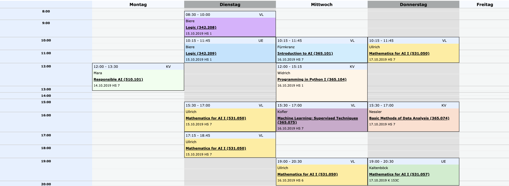

# How to start the university semester properly

xxxxxxx - httpsasdfafasfasfdasf

After finishing my law degree I now decided to formalize my knowledge in math and programming. Fortunately, JKU Linz came out with a new study called "Artificial Intelligence". They also offer a distance learning option for people from Vienna. As I wanted to start studying statistics anyways, this came in handy. Now I want to share the way I organize myself throughout the semester, as I think it might be helpful for some fellow students.

## Table of Contents

##

## 1. Get an overview

I always start my semester with an overview and classification of all classes. This is essential to keep track with all the assignments.

As you can see, this seems a lot.
Not only are there many classes to be taken, the content is also intense.
To get an overview I just go through all the course information and see which classes take the most time and effort.

## 2. Arrange your organization platform

Most universities have a platform, where they manage the course materials and online assignments are done.
In my case this is moodle. I try to organize it as much as possible to schedule my tasks according to the [Eisenhower Matrix](https://www.eisenhower.me/eisenhower-matrix/).
This helps because there is always so much to learn, but to finish the courses it is sufficient to get the most important things done.

## 3. Find Pareto Optima

The next step is to analyze the classes from a [Pareto](https://en.wikipedia.org/wiki/Pareto_principle) perspective.
It is nice to learn as much as possible, but often we don't have the time to learn everything at all. Thankfully Pareto helps with his principle. Find out what 20% of the course are the most important ones. In most cases these are the assignment. In assignments teacher see the core skills of the lecture covered (that's why they are covered in the assignment)

## 4. Find a workflow to get everything done

This will differ from everyone.
For example, do I work full-time and have many other projects to do as well. Everybody keeps reminding you that "it is not possible to get everything done" or that "you have to focus 100% only on your studies". This is often not true. You can most of the time find ways to get everything done. What do I mean with that and how can you do it. Let me explain how I will do it this semester.

First of all, I am more efficient if I just read the material and work through the exercises. I have been studying now for more than 5 years, and for me sitting in lectures is often an incredible waste of my precious time. Therefore I always start with the exercises to see what is actually demanded by the professor. Afterwards I read through the study material and try to answer all questions/assignments while I do this. 
I repeat this with every class I have until all my deadlines are met. 
Afterwards I go through additional learnin materials. For example streamings, additional slides, additional articles and so on.

---

## About

I consider myself a problem solver. My strengths are to navigate in complex environments, provide solutions and breaking them down.
My knowledge and interests evolve around business law and programming machine learning applications.
I provide services in building data analysis and evaluating business-related concepts.

Connect on:
- [LinkedIn](https://www.linkedin.com/in/createdd)
- [Github](https://github.com/Createdd)
- [Medium](https://medium.com/@createdd)
- [Twitter](https://twitter.com/_createdd)
- [Patreon](https://www.patreon.com/createdd)
- [Instagram](https://www.instagram.com/create.dd/)

## Support and Mails

https://www.patreon.com/createdd

https://upscri.be/481d76

<!-- Written by Daniel Deutsch -->