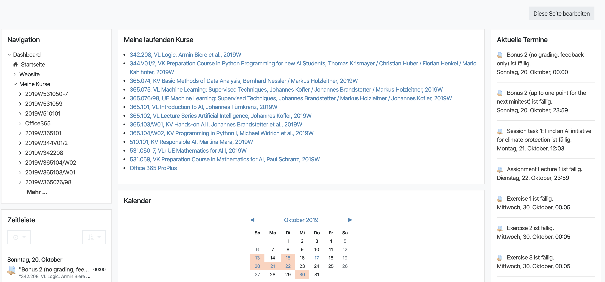

# How to organize your studies while working

After finishing my law degree I now decided to formalize my knowledge in math and programming. Fortunately, JKU Linz came out with a new study called "Artificial Intelligence". They also offer a distance learning option for people from Vienna. As I wanted to start studying statistics anyways, this came in handy. Now I want to share the way I organize myself throughout the semester, as I think it might be helpful for some fellow students.

## Table of Contents
- [How to organize your studies while working](#how-to-organize-your-studies-while-working)
  - [Table of Contents](#table-of-contents)
  - [0. About me and going paperless](#0-about-me-and-going-paperless)
  - [1. Get an overview](#1-get-an-overview)
  - [2. Arrange your organization platform](#2-arrange-your-organization-platform)
  - [3. Find Pareto Optima](#3-find-pareto-optima)
  - [4. Find a workflow to get everything done](#4-find-a-workflow-to-get-everything-done)
  - [5. Work around exam dates](#5-work-around-exam-dates)
  - [6. Breathe](#6-breathe)
  - [About](#about)
  - [Support and Mails](#support-and-mails)

## 0. About me and going paperless

I have already studied law and now want to be more efficient with my new studies. So this time I went paperless. (#paperlessStudent)
I was just annoyed by all the paper, printing, carrying and inefficiency at all.
So for this studies I got myself an iPad and try to organize everything with it.

This already had proven to be very good as the world today is very fast and mobile. People do not longer want to carry 5 books with them just to do homework. Now I transformed myself to a digital, paperless student and is already great. Currently I use Notability for the iPad and for coding VSCode. If you have any productivity tools which are amazing, feel free to comment them.

## 1. Get an overview

I always start my semester with an overview and classification of all classes. This is essential to keep track with all the assignments.

As you can see, this seems a lot.
Not only are there many classes to be taken, the content is also intense.
To get an overview I just go through all the course information and see which classes take the most time and effort.

## 2. Arrange your organization platform

Most universities have a platform, where they manage the course materials and online assignments are done.
In my case this is moodle. I try to organize it as much as possible to schedule my tasks according to the [Eisenhower Matrix](https://www.eisenhower.me/eisenhower-matrix/).
This helps because there is always so much to learn, but to finish the courses it is sufficient to get the most important things done.

## 3. Find Pareto Optima

The next step is to analyze the classes from a [Pareto](https://en.wikipedia.org/wiki/Pareto_principle) perspective.
It is nice to learn as much as possible, but often we don't have the time to learn everything at all. Thankfully Pareto helps with his principle. Find out what 20% of the course are the most important ones. In most cases these are the assignment. In assignments teacher see the core skills of the lecture covered (that's why they are covered in the assignment)

## 4. Find a workflow to get everything done

This will differ from everyone.
For example, do I work full-time and have many other projects to do as well. Everybody keeps reminding you that "it is not possible to get everything done" or that "you have to focus 100% only on your studies". This is often not true. You can most of the time find ways to get everything done. What do I mean with that and how can you do it. Let me explain how I will do it this semester.

First of all, I am more efficient if I just read the material and work through the exercises. I have been studying now for more than 5 years, and for me sitting in lectures is often an incredible waste of my precious time. Therefore I always start with the exercises to see what is actually demanded by the professor. Afterwards I read through the study material and try to answer all questions/assignments while I do this.
I repeat this with every class I have until all my deadlines are met.
Afterwards I go through additional learning material. For example streamings, additional slides, additional articles and so on.

This process is scheduled to my working hours. If I work from 9am to 5pm, I will have a break after I come home and start immediately after the break with my studies.

Of course, the weekends will be primarily used for the more complex assignments, which couldn't be finished during the week.

## 5. Work around exam dates

A huge issue when working full-time are exams. Exams are scheduled the way the university likes. And most of the time they cannot schedule the time for full-time working students.
The way I solve this is the following:

1. Ask the professor if there is a way to re-schedule or if there are other dates available
2. Schedule work leave or holiday for the key exams. (In most countries you are entitled to holidays)
3. If the exam is online and around lunch time you can use your lunchtime for taking the test (yes, this is crazy but doable)
4. If the exam is online and just a short multiple choice test. You can use the toilet.(yes, this is hardcore - but necessary if your employer doesn't support your ambitious goals)
5. If the exam is not online and you do not get a holiday, you have to take it next semester. Be careful to structure your classes so there is a good mix of online and in-person exams. (if possible)

## 6. Breathe

As you are studying and doing work as well I guess you are ambitions and motivated as hell. So this might seem counter intuitive but it is vital. Breath and relax. There is no way to work all the time 100%. Better to chill in between, but when you work, then work.

Ultimately doing full-time work and a study at the same thing comes down to mindset. It is possible but requires discipline. It is useful to see the studying as a pursuit to learning for life rather than just getting a degree. Because the degree will not be enough motivation for you to keep through all of it over a period of (more than) three years.

If you have any questions feel free to ask. I can also write an article about concepts that are especially interesting to you.

---

## About

I consider myself a problem solver. My strengths are to navigate in complex environments, provide solutions and breaking them down.
My knowledge and interests evolve around business law and programming machine learning applications.
I provide services in building data analysis and evaluating business-related concepts.

Connect on:
- [LinkedIn](https://www.linkedin.com/in/createdd)
- [Github](https://github.com/Createdd)
- [Medium](https://medium.com/@createdd)
- [Twitter](https://twitter.com/_createdd)
- [Patreon](https://www.patreon.com/createdd)
- [Instagram](https://www.instagram.com/create.dd/)

## Support and Mails

https://www.patreon.com/createdd

https://upscri.be/481d76

<!-- Written by Daniel Deutsch -->