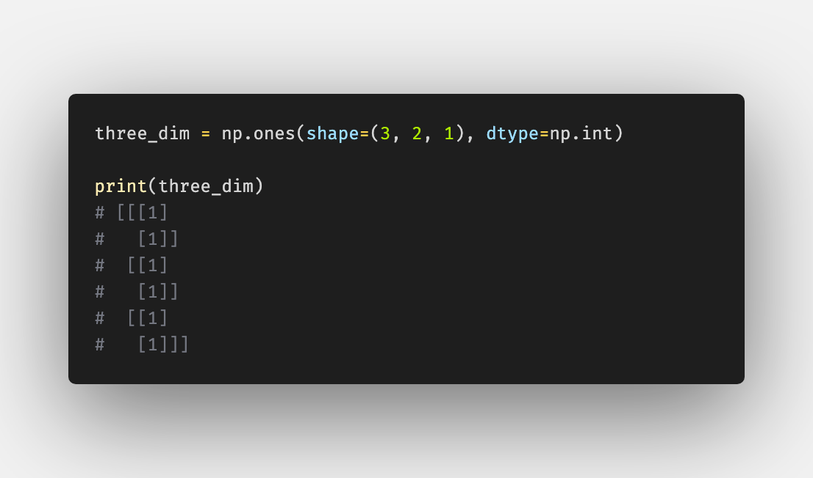
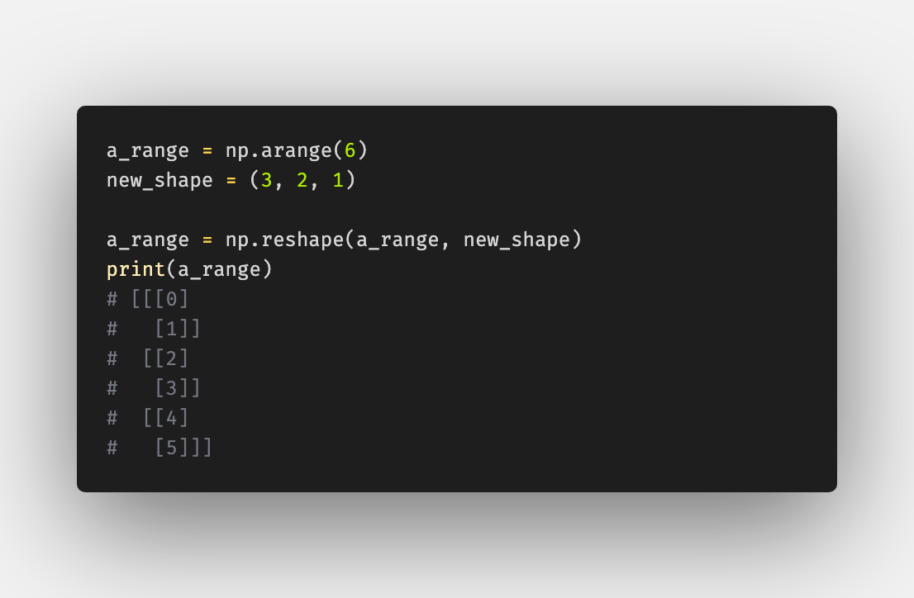
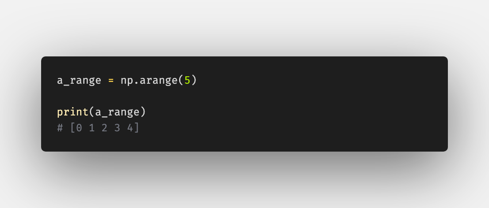
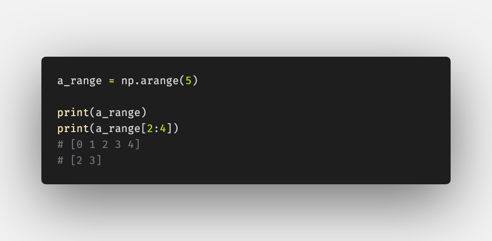
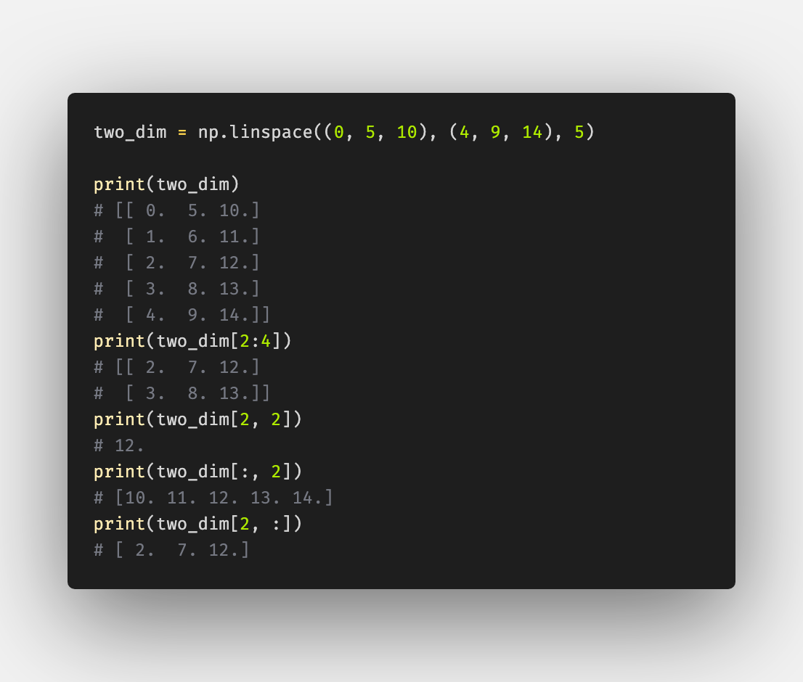
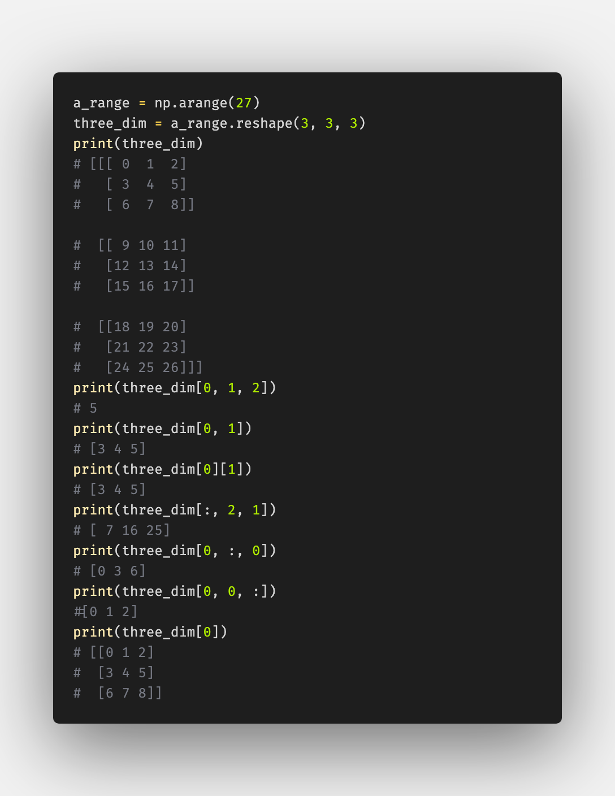
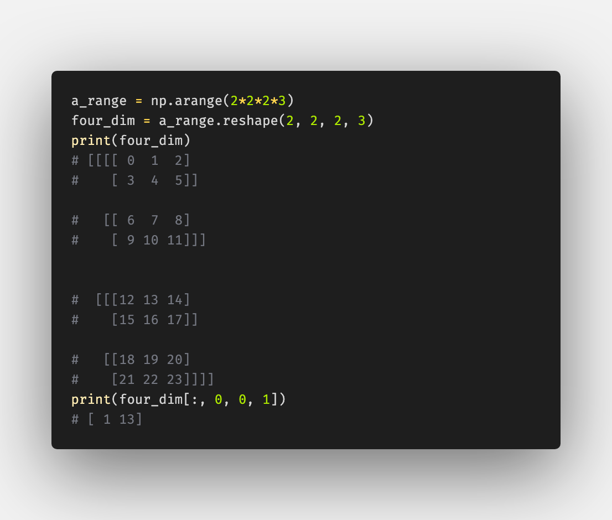

# Numpy Shapes and Slices in Overview

Photo by Hunter Harritt - https://unsplash.com/photos/Ype9sdOPdYc

As data scientist / machine learning engineer it is necessary to deal with many Numpy arrays. Sometimes in the process I lose overview about all shaping and indexing syntax, so here is an overview.

## Shapes and Dimensions

#### Shape 1 Dim

#### Shape 2 Dim

#### Shape 3 Dim

#### Reshaping:

## Arranging

#### Arange with slice:

## Indexing

#### Index with slice

#### Indexing 2 dim array

#### Indexing 3 dim array

The same principles for more dimensional arrays:
####  Indexing 4 dim array

A really good article with nice visualization can be found here: https://www.pythoninformer.com/python-libraries/numpy/index-and-slice/

---

## About

Daniel is an entrepreneur, software developer, and lawyer.
His knowledge and interests evolve around business law and programming machine learning applications.
To the core, he considers himself a problem solver of complex environments, which is reflected in his various projects.
Don't hesitate to get in touch if you have ideas, projects or problems.

**Connect on:**
- [LinkedIn](https://www.linkedin.com/in/createdd)
- [Github](https://github.com/Createdd)
- [Medium](https://medium.com/@createdd)
- [Twitter](https://twitter.com/_createdd)
- [Instagram](https://www.instagram.com/create.dd/)

<!-- Written by Daniel Deutsch -->